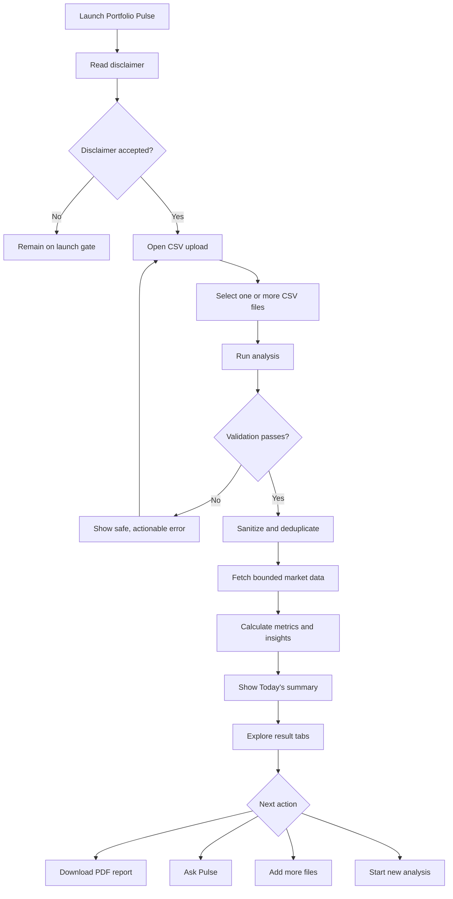
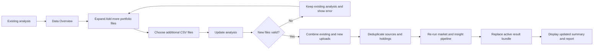
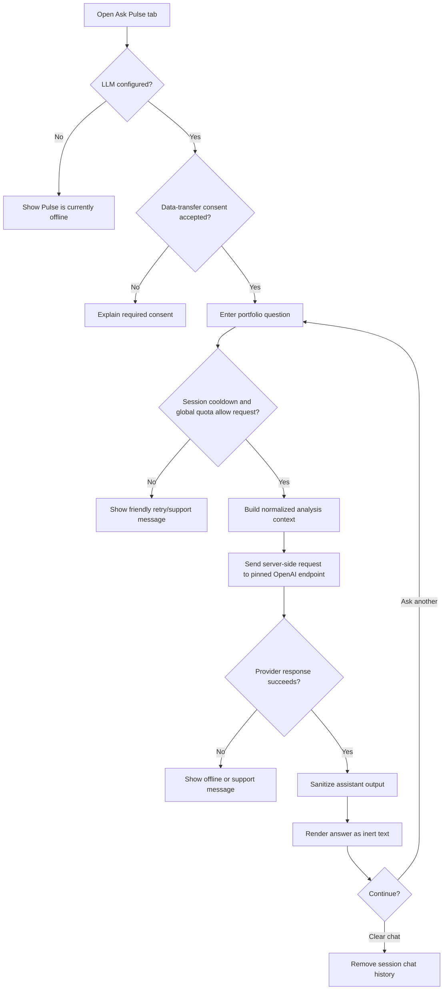
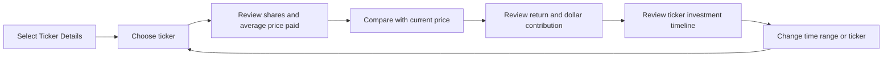
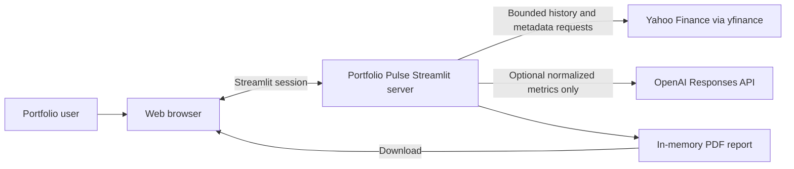
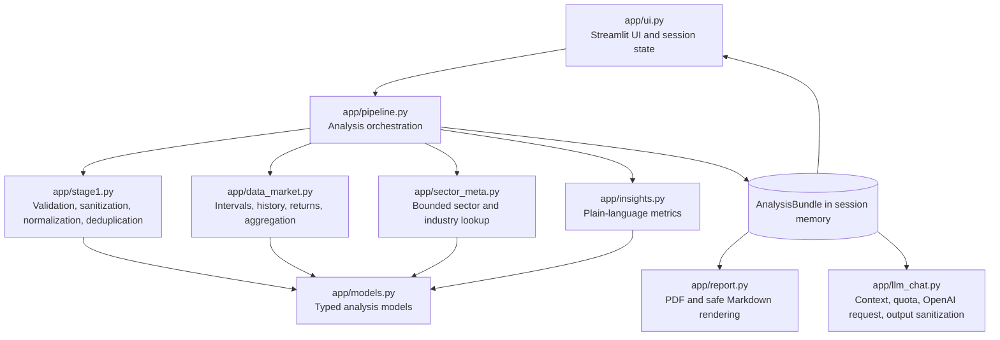
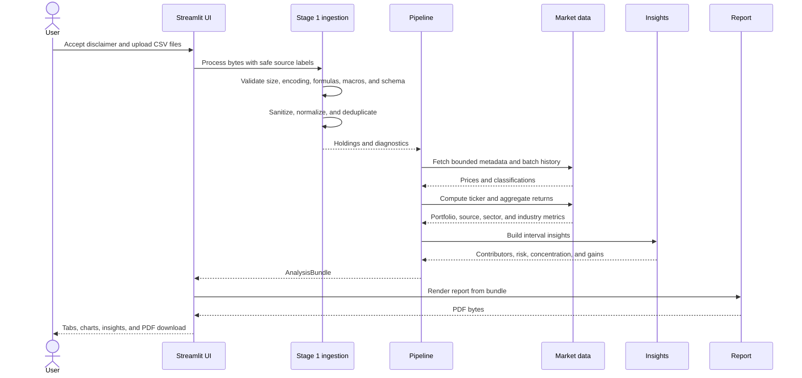
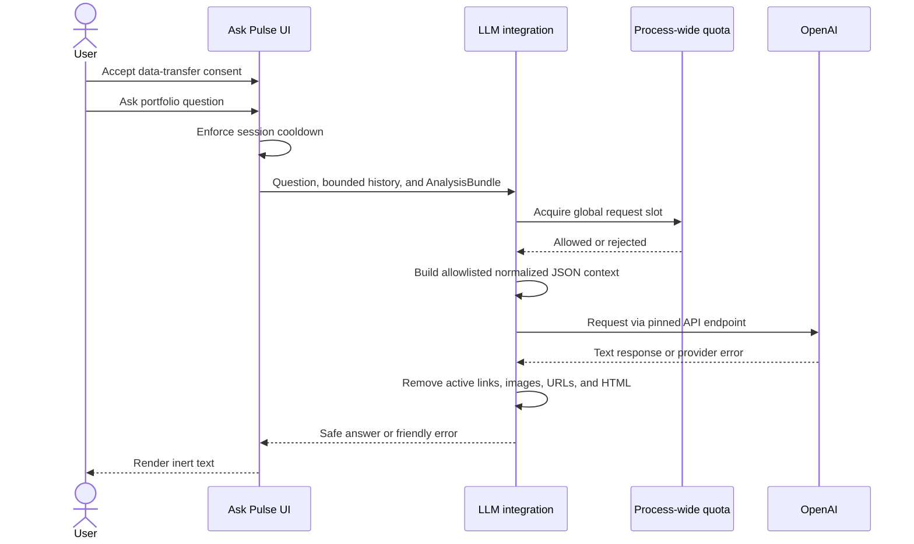
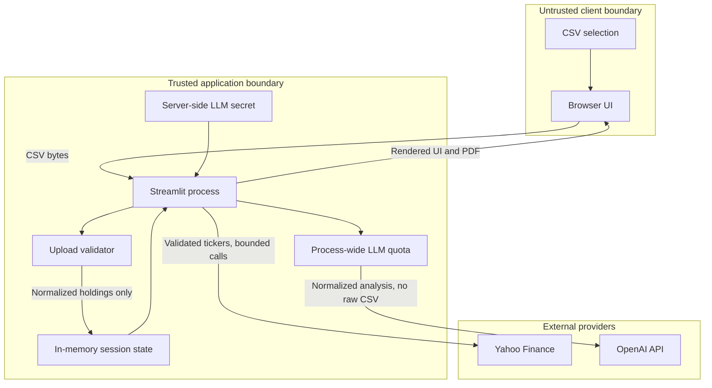
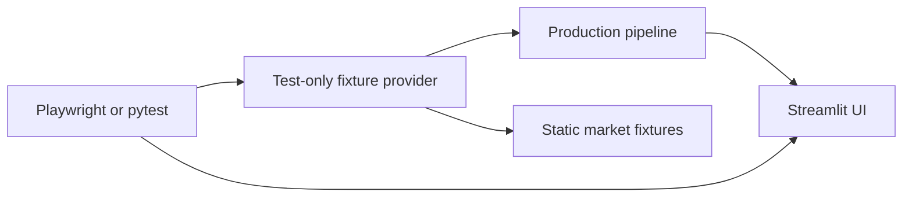

# Portfolio Pulse

## Product Requirements Document

**Version:** 2.0  
**Status:** Implemented baseline  
**Last updated:** August 16, 2026  
**Product tagline:** Clear direction for every holding.

---

## 1. Executive Summary

Portfolio Pulse is a responsive Streamlit application that turns one or more
portfolio CSV exports into understandable portfolio insights. It validates and
sanitizes uploaded holdings, retrieves bounded market data, computes portfolio
and ticker performance over common time ranges, and explains the results in
plain language.

The product is designed for users who want answers to questions such as:

- How much is my portfolio worth?
- How much did it gain or lose in dollars and percent?
- Which holdings helped or hurt performance?
- Is my portfolio concentrated or diversified?
- How much has this portfolio historically moved up and down?
- What did I pay for each position, and what is its current price?
- How have my investments changed over time?

Portfolio Pulse is educational software. It does not execute trades, access
brokerage accounts, predict returns, or issue personalized buy, sell, or hold
recommendations.

### 1.1 Product principles

1. **Plain language first:** explain what a metric means before exposing finance
   terminology.
2. **Show the money:** pair percentages with dollar values wherever possible.
3. **Privacy by default:** retain only fields required for analysis and never
   expose provider credentials to the browser.
4. **Safe, non-advisory guidance:** provide facts and review prompts, not trading
   instructions.
5. **Progressive detail:** start with a one-line summary, then allow users to
   explore portfolio, source, industry, and ticker-level results.
6. **Deterministic quality:** maintain automated unit, security, responsive, and
   theme-adaptation tests.

---

## 2. Goals and Non-Goals

### 2.1 Goals

- Accept one or more portfolio holdings CSV files.
- Require disclaimer acceptance before the application can be used.
- Strictly validate file type, size, row count, formulas, macros, and schema.
- Mask recognizable sensitive data and discard unsupported free-text fields.
- Detect exact and semantic duplicate uploads.
- Normalize holdings and preserve purchase dates where provided.
- Calculate returns for `1M`, `3M`, `YTD`, `1Y`, and `3Y`.
- Calculate portfolio, source, sector, industry, and ticker-level metrics.
- Explain contributors, detractors, concentration, diversification, historical
  swinginess, drawdown, estimated gains on paper, and recent lot activity.
- Support adding files to an existing analysis.
- Show current ticker price and ticker-level investment history.
- Generate a downloadable PDF report.
- Provide an optional server-side LLM assistant grounded in normalized analysis
  data.
- Support light and dark themes across phone, tablet, and desktop layouts.

### 2.2 Non-goals

- Brokerage login, account synchronization, or trade execution.
- User authentication or multi-user authorization in the current release.
- Personalized investment advice or buy/sell/hold recommendations.
- News retrieval, sentiment analysis, or analyst sentiment scoring.
- Return prediction or price forecasting.
- Tax calculation or realized-gain calculation without complete transaction
  history.
- Forward dividend forecasting.
- Persistent storage of uploaded CSV files or portfolios.
- Support for spreadsheet formats such as XLS, XLSX, or macro-enabled workbooks.
- Support for formulas or executable spreadsheet content inside CSV files.

---

## 3. Target Users and Use Cases

### 3.1 Primary persona

An individual investor with one or more CSV portfolio exports who wants an
understandable view of portfolio performance without needing advanced finance
knowledge.

### 3.2 Secondary personas

- A student demonstrating data engineering, analytics, security, and UI design.
- A reviewer evaluating a complete local analytics workflow.
- A portfolio learner exploring concentration, diversification, and historical
  behavior.

### 3.3 Core use cases

1. Run a first analysis from one or more CSV files.
2. Add another portfolio source to an existing analysis.
3. Compare performance by source and industry.
4. Explore the current value and history of a specific ticker.
5. Download a presentation-ready PDF report.
6. Ask plain-language questions about the calculated analysis.
7. Switch between light and dark themes without losing results.
8. Start a new analysis and clear the active portfolio state.

---

## 4. User Experience

### 4.1 Application shell

The application header must contain:

- Portfolio Pulse logo and name.
- Tagline.
- `New analysis` action when results exist.
- Light/dark theme icon.

The header must remain visible while the results page scrolls. The results
header must include the analysis date and `Download PDF report` action.

### 4.2 Launch disclaimer

On first launch, the user must see the complete educational-use disclaimer:

> This analysis is for informational and educational purposes only and is not
> targeted to provide financial advice or investment advice. You should rely on
> your own research and/or consult a qualified financial professional.

The user cannot access upload or analysis features until the acceptance
checkbox is selected.

### 4.3 Analysis navigation

Results must use the following tabs:

1. **Data Overview**
2. **Performance**
3. **Ticker Details**
4. **Ask Pulse**

The interface must not expose internal implementation labels such as “Stage 1,”
“Stage 2,” or “Stage 3” as product navigation.

### 4.4 Shared time-range control

The result page must make time ranges obvious and provide:

- `1M`
- `3M`
- `YTD` — default
- `1Y`
- `3Y`

The selected interval controls the summary, metrics, charts, ticker details,
and LLM analysis context.

### 4.5 Today’s summary

The top of the results page must present a one-line summary in this form:

> Your portfolio is up/down $X (+/-Y%). Biggest contributor: TICKER (+$A).
> Biggest drag: TICKER (-$B).

When no positive contributor or detractor exists, the summary must state
`none` rather than fabricate a result.

### 4.6 Data Overview requirements

Data Overview must provide:

- Expander to add more portfolio files and update the current analysis.
- Upload and parsing diagnostics.
- File, source, ticker, and holding counts.
- Human-readable holdings table.
- Positions by what the user paid, approximately.
- Overall portfolio investment timeline.
- Source labels that do not expose original filenames.
- User-friendly warnings without raw malformed-row content.

### 4.7 Performance requirements

Performance must prioritize:

1. Portfolio value.
2. Dollar and percentage change for the selected interval.
3. Top contributors and detractors with dollar impact.
4. Diversification health.
5. Top-three and largest-position concentration.
6. Historical swinginess and maximum drawdown.
7. Estimated gains on paper.
8. Historical income component.
9. Recently added lots.
10. Source and industry comparisons.

Required visualizations include:

- Portfolio return trend by interval.
- Positions by what the user paid, approximately.
- Source comparison by net return and net growth.
- Industry comparison by net return and net growth.
- Sector allocation or equivalent concentration view.

### 4.8 Ticker Details requirements

Ticker Details must provide:

- Ticker selector.
- Total shares.
- Average price paid.
- Current market price.
- Difference between current price and average price paid.
- Sector and industry.
- Ticker returns by interval.
- Ticker contribution in dollars.
- Ticker-level investment timeline based on purchase dates.
- Human-readable table and chart labels.

### 4.9 Ask Pulse requirements

Ask Pulse must:

- Display an explicit consent checkbox before portfolio metrics are sent to
  OpenAI.
- Explain that raw CSV bytes, original filenames, unsupported columns, and API
  keys are not sent.
- Use normalized holdings, calculated insights, and ticker performance as the
  only portfolio context.
- Retain a bounded conversation history in the active Streamlit session.
- Support clearing the chat.
- Render assistant output as inert text rather than active HTML or links.
- Refuse unsupported claims and personalized trading instructions through
  system instructions.
- Display customer-friendly offline, rate-limit, and support messages.

### 4.10 Responsive and theme behavior

- Support phone viewport `390x844`.
- Support tablet viewport `768x1024`.
- Support desktop viewport `1280x720` and larger.
- Allow Streamlit components to reflow rather than relying on fixed-width
  layouts.
- Maintain readable contrast in both native light and dark themes.
- Preserve the active analysis when the theme changes.

---

## 5. User Journeys

### 5.1 First analysis journey



### 5.2 Add-more-files journey



### 5.3 Ask Pulse journey



### 5.4 Ticker investigation journey



---

## 6. CSV Input Contract

### 6.1 Required columns

| Column | Type | Rule |
|---|---|---|
| `ticker` | String | Required; normalized and validated against the safe ticker pattern |
| `avg_purchase_price` | Number | Required; must be greater than zero |
| `shares` | Number | Required; must be greater than zero |

### 6.2 Optional columns

| Column | Type | Rule |
|---|---|---|
| `purchase_date` | Date | Optional; invalid dates do not remove the holding but are excluded from timelines |
| `currency` | String | Optional; retained only for accepted schema handling |
| `security_type` | String | Optional; normalized through an allowlist |

Supported security types are:

- Stock / Equity
- ETF
- REIT
- Fund
- Bond
- Cash
- Option

Unknown security types must not be retained as free text.

### 6.3 Column aliases

The ingestion layer should normalize common aliases:

- `symbol` -> `ticker`
- `avg_price`, `average_purchase_price`, `purchase_price` ->
  `avg_purchase_price`
- `qty`, `quantity`, `share_count` -> `shares`

### 6.4 Upload limits

- File extension: `.csv` only.
- Encoding: UTF-8, including UTF-8 with BOM.
- Maximum file size: 2 MB per CSV.
- Maximum file count: 10.
- Maximum combined size: 10 MB.
- Maximum combined parsed rows: 2,000.
- Maximum unique tickers: 100.
- Binary files or files containing NUL bytes must be rejected.
- Any cell beginning with `=`, `+`, `-`, or `@` after leading whitespace
  must cause the entire file to be rejected as potential spreadsheet formula
  content.
- Macro and macro-like executable signatures must cause the entire file to be
  rejected.

### 6.5 Sanitization and data minimization

- Detect and redact emails, phone numbers, SSNs, and credit-card-like values.
- Redact object columns with sensitive headers such as email, phone, account,
  tax ID, passport, address, name, or date of birth.
- Project the parsed dataframe to the supported column allowlist before
  normalized holdings are created.
- Replace original filenames with labels such as `Portfolio file 1`.
- Never include raw malformed rows in diagnostics.
- Never log raw uploaded data.

### 6.6 Deduplication

1. Compute a SHA-256 hash of each upload.
2. Mark byte-identical uploads as exact duplicates.
3. Build a semantic fingerprint from normalized `ticker`,
   `avg_purchase_price`, and `shares`.
4. Mark normalized-content matches as semantic duplicates.
5. Exclude duplicate sources from calculations while preserving safe duplicate
   diagnostics.

---

## 7. Analysis and Calculation Requirements

### 7.1 Time windows

The pipeline must create the following interval windows relative to the
analysis date:

| Interval | Start |
|---|---|
| `1M` | One month before the analysis date |
| `3M` | Three months before the analysis date |
| `YTD` | January 1 of the analysis year |
| `1Y` | One year before the analysis date |
| `3Y` | Three years before the analysis date |

Start and end dates must be aligned to available market observations.

### 7.2 Market data

For each validated ticker, retrieve:

- Close price.
- Adjusted close price.
- Historical observations covering the earliest required interval start
  through the analysis date.
- Sector, industry, and company name where available.

Market history must use one bounded batch call. The application must not fan
out to a per-ticker history fallback when a batch result is missing.

Metadata lookup must use:

- Maximum 8 worker threads.
- 15-second overall batch wait.
- Bounded in-memory cache.
- `Unknown` fallback values when unavailable or timed out.

### 7.3 Per-ticker calculations

For ticker `j`, shares `s`, start close `C_start`, end close `C_end`, start
adjusted close `A_start`, and end adjusted close `A_end`:

**Start market value**

```text
MV_start = s * C_start
```

**End market value**

```text
MV_end = s * C_end
```

**Price return**

```text
Return_price = (C_end - C_start) / C_start
```

**Total return from adjusted prices**

```text
Return_total = (A_end - A_start) / A_start
```

**Historical income component**

```text
Return_income = Return_total - Return_price
```

**Dollar components**

```text
PnL_price = MV_start * Return_price
PnL_income = MV_start * Return_income
PnL_net = PnL_price + PnL_income
```

The income component is an estimate inferred from adjusted prices. It must not
be labeled as a dividend forecast.

### 7.4 Aggregate calculations

Calculate the same metrics for:

- Entire portfolio.
- Each non-duplicate source.
- Each sector.
- Each industry.

Aggregate returns must be value-weighted:

```text
Portfolio_return_net = sum(PnL_net) / sum(MV_start)
```

### 7.5 IRR approximation

The current implementation exposes a two-point IRR approximation where
possible. The configured baseline policy is:

```text
YTD_start (Jan 1 of current year)
```

IRR must be presented as an approximation because the holdings snapshot does
not provide a complete cash-flow ledger.

### 7.6 Plain-language insights

For every available interval, calculate:

- Portfolio value.
- Net growth in dollars.
- Net return percent.
- Top three positive contributors.
- Top three detractors.
- Top-three concentration percent.
- Largest holding and its weight.
- Diversification score from 0 to 100.
- Annualized historical volatility.
- Maximum historical drawdown.
- Estimated unrealized gain:

```text
Current portfolio value - total approximate amount paid
```

- Historical income component.
- Number of purchase lots added within the previous 90 days.
- Sector weights.

### 7.7 Interpretation rules

- “Swinginess” must translate annualized volatility into plain language.
- Drawdown must be described as a historical worst decline, not a forecast.
- Gains on paper must be labeled estimated.
- Realized gains must state `Tracking needed` because sell history is absent.
- Forward income must not be forecast from the current schema.
- Suggestions must use review-oriented language such as:
  - “Review whether this concentration matches your comfort level.”
  - “Consider how future contributions affect diversification.”
- Suggestions must never direct the user to buy, sell, or hold a security.

---

## 8. Technical Architecture

### 8.1 System context



### 8.2 Component architecture



### 8.3 Analysis sequence



### 8.4 LLM request sequence



### 8.5 Deployment and trust boundaries



### 8.6 Session state

The application stores the active analysis only in Streamlit session memory.
Expected session keys include:

- Disclaimer acceptance.
- Theme preference and delivered theme.
- Current `AnalysisBundle`.
- Sanitized analysis-file byte tuples needed for add-more-files behavior.
- Upload-widget generation counters.
- Selected interval and UI controls.
- Bounded chat history.
- Last LLM request time.

`New analysis` must remove the active bundle and upload state, increment the
upload generation, and rerun the application.

### 8.7 Data persistence

- Uploaded files are not written to application storage.
- Analysis results are not stored in a database.
- PDF reports are generated in memory.
- Chat messages are stored only in the active session.
- Market metadata uses bounded in-process caching.
- Test fixtures live outside production modules.

---

## 9. Module Responsibilities

### 9.1 `app/ui.py`

- Page configuration and native theme synchronization.
- Disclaimer gate.
- Sticky header and navigation.
- Upload and add-more-files interactions.
- Session-state lifecycle.
- Data Overview, Performance, Ticker Details, and Ask Pulse rendering.
- PDF download.
- Friendly validation and provider error presentation.

### 9.2 `app/stage1.py`

- Upload count and byte-limit validation.
- UTF-8 decoding and CSV parsing.
- Formula and macro rejection.
- PII/NPI masking.
- Column canonicalization and allowlisting.
- Ticker and security-type validation.
- Decimal conversion.
- Exact and semantic deduplication.
- Safe diagnostics.

### 9.3 `app/data_market.py`

- Interval construction.
- Safe ticker filtering.
- Single bounded yfinance history batch.
- Trading-day alignment.
- Per-lot and per-ticker metrics.
- Portfolio, source, sector, and industry aggregation.
- Two-point IRR approximation.

### 9.4 `app/sector_meta.py`

- Safe ticker filtering.
- Concurrent metadata lookup with bounded workers.
- Global metadata timeout.
- In-memory result cache.
- Unknown-value fallback.

### 9.5 `app/insights.py`

- Portfolio value path.
- Historical volatility and drawdown.
- Contributors and detractors.
- Concentration and diversification score.
- Estimated unrealized gain and income component.
- Recent-lot and sector-weight insights.

### 9.6 `app/report.py`

- PDF report generation.
- Human-readable source mapping.
- Portfolio, source, sector, and industry tables.
- Plain-language summary.
- Safe escaping of external labels.

### 9.7 `app/llm_chat.py`

- Server-side API-key loading.
- Pinned OpenAI API endpoint.
- Bounded context and history.
- Normalized analysis context.
- Prompt-injection-resistant system and developer instructions.
- Process-wide request quota.
- Provider timeout.
- Safe logging and customer-facing errors.
- Assistant output sanitization.

### 9.8 `app/pipeline.py`

- End-to-end orchestration.
- Injectable market and metadata providers for tests.
- Missing-market-data diagnostics.
- Construction of the final `AnalysisBundle`.

---

## 10. Data Model

### 10.1 Holding

```text
Holding
  source_id: string
  source_name: safe display label
  ticker: string
  shares: Decimal
  avg_purchase_price: Decimal
  purchase_date: date | null
  security_type: allowlisted string
```

### 10.2 Analysis bundle

```text
AnalysisBundle
  diagnostics: Stage1Diagnostics
  holdings: Holding[]
  intervals: IntervalWindow[]
  ticker_metrics: TickerIntervalMetrics[]
  portfolio_metrics: AggregateMetrics[]
  by_source: AggregateMetrics[]
  by_sector: AggregateMetrics[]
  by_industry: AggregateMetrics[]
  insights: IntervalInsights[]
  irr_policy: string
  as_of: date
```

### 10.3 Aggregate metric

```text
AggregateMetrics
  label
  interval
  mv_start
  mv_end
  pnl_price
  pnl_div
  pnl_net
  return_price_pct
  return_div_pct
  return_net_pct
  irr_pct
  num_tickers
  top_n_by_net_pnl
```

### 10.4 Interval insight

```text
IntervalInsights
  interval
  portfolio_value
  net_growth
  net_return_pct
  contributors
  detractors
  top_three_concentration_pct
  largest_holding
  largest_holding_pct
  diversification_score
  annualized_volatility_pct
  max_drawdown_pct
  estimated_unrealized_gain
  estimated_income_component
  recent_lot_count
  sector_weights
```

---

## 11. PDF Report Requirements

The downloaded report must be a valid PDF and contain:

1. Portfolio Pulse title.
2. Educational-use disclaimer.
3. Analysis date.
4. Today’s summary.
5. Ingestion and sanitization diagnostics.
6. Portfolio performance by interval.
7. Net growth in dollars.
8. Source comparison using safe source labels.
9. Sector comparison.
10. Industry comparison.
11. Top contributors.
12. Plain-language concentration, diversification, swinginess, drawdown,
    estimated gains, and income notes.
13. Clear labels where transaction or forecast data is unavailable.

The report must not contain:

- Original uploaded filenames.
- Raw CSV content.
- API keys or provider errors.
- Active user-supplied markup.
- Sentiment analysis or trading recommendations.

---

## 12. Security and Privacy Requirements

### 12.1 Secrets

- API keys must come from server environment variables or ignored Streamlit
  secrets.
- Supported key names are `LLM_API_KEY`, `OPENAI_API_KEY`, or
  `[llm].api_key`.
- Secrets must never be committed, logged, sent to the browser, included in a
  PDF, or added to a CSV.
- `.env`, `.env.*`, `.streamlit/secrets.toml`, and secret backup variants must
  remain ignored.
- Custom LLM base URLs are not supported.
- The OpenAI client must explicitly use `https://api.openai.com/v1`.

### 12.2 LLM controls

- Maximum question length: 2,000 characters.
- Maximum retained provider history: 8 messages.
- Maximum context holdings and ticker metrics: 100.
- Maximum output tokens: 700.
- Provider storage: disabled.
- Provider timeout: 30 seconds.
- Session cooldown: 2 seconds.
- Process-wide quota: 20 requests per 60 seconds.
- Log only safe metadata such as status, code, and request ID.
- Do not log exception bodies, prompts, context, URLs, or credentials.

### 12.3 Output safety

Assistant output must strip:

- Markdown images.
- Markdown links while preserving visible labels.
- HTTP and HTTPS URLs.
- HTML tags.

Chat content must be rendered as text.

### 12.4 Network controls

- Market requests accept only validated ticker symbols.
- History retrieval uses one bounded batch request.
- Metadata uses bounded concurrency, cache, and timeout.
- LLM traffic uses a pinned external endpoint.
- Streamlit XSRF and CORS protections remain enabled.

### 12.5 Authentication status

Authentication is not included in the current product scope. Any public or
multi-tenant deployment must add authentication and stronger user-level or
distributed quotas before production release.

---

## 13. Error Handling

### 13.1 Upload errors

Errors must identify the affected safe file label and remediation without
echoing untrusted cell contents. Examples:

- `Portfolio file 1 exceeds the 2 MB CSV file limit.`
- `Portfolio file 1 must be a UTF-8 plain-text CSV file.`
- `Portfolio file 1 was rejected because row 4 contains a spreadsheet formula.`
- `Combined CSV uploads cannot exceed 2,000 rows.`
- `Missing required columns for Portfolio file 1: [...]`

### 13.2 Market-data errors

- Continue analysis when some tickers lack market history.
- Add safe diagnostics such as `No market data for TICKER; metrics skipped.`
- Use `Unknown` for unavailable sector or industry metadata.
- Never block indefinitely waiting for per-ticker provider fallbacks.

### 13.3 Ask Pulse errors

Use these support-style messages:

- Configuration or connection unavailable:
  `Pulse is currently offline. Please try again in some time.`
- Quota, provider, or unexpected request error:
  `We're having trouble answering right now. Please try again later, or contact
  support if this keeps happening.`

Do not expose:

- HTTP status codes.
- Provider error bodies.
- Request internals.
- Quota codes.
- API keys.

---

## 14. Testing and Quality Requirements

### 14.1 Unit and security tests

Tests must cover:

- Ticker normalization and validation.
- PII masking.
- Exact and semantic deduplication.
- Lenient handling of malformed rows without data leakage.
- Empty and invalid CSV behavior.
- 2 MB file limit.
- File count and total row limits.
- Formula and macro rejection.
- Non-CSV rejection.
- Safe filename replacement.
- Unsupported security-type removal.
- Time intervals and return calculations.
- Insight calculations.
- PDF signature and content.
- LLM configuration, endpoint pinning, context minimization, question limit,
  global quota, provider errors, and output sanitization.
- Single market-history batch without per-ticker fallback.
- Metadata global timeout behavior.

### 14.2 End-to-end tests

Playwright must exercise:

- Disclaimer acceptance.
- Multiple-file upload.
- Analysis completion.
- Data Overview, Performance, Ticker Details, and Ask Pulse tabs.
- Add-more-files control.
- Current ticker price.
- PDF download action.
- Sticky header and New analysis action.
- Light-to-dark-to-light theme adaptation.
- Phone, tablet, and desktop viewports.

### 14.3 Test architecture

Production code must not inspect an environment variable to enter test mode.
The E2E harness must inject deterministic market and metadata providers through
`e2e/fixture_app.py`.



### 14.4 Current acceptance baseline

- Python tests: 39 passing.
- Playwright tests: 6 passing.
- Viewports: phone, tablet, and desktop.
- Theme audit: no recorded contrast failures.
- Dependency audit: no known vulnerabilities in the locked dependency set as
  of August 16, 2026.

---

## 15. Deployment Requirements

### 15.1 Runtime

- Python 3.11 or newer; Python 3.12 recommended.
- Install dependencies from the hashed lockfile:

```bash
pip install --require-hashes -r requirements.lock
```

- Start the application:

```bash
streamlit run run_app.py
```

### 15.2 Streamlit configuration

- Default theme: light.
- Usage telemetry: disabled.
- Automatic source reload: disabled.
- Maximum upload size: 2 MB.
- XSRF protection: enabled.
- CORS protection: enabled.

### 15.3 Production recommendations

Before an internet-facing production launch:

- Add authentication and user authorization.
- Terminate TLS at a trusted reverse proxy or managed platform.
- Add distributed rate limiting if multiple Streamlit processes or replicas
  are used.
- Add centralized health monitoring without sensitive payload logging.
- Set OpenAI project spending limits and alerts.
- Establish data-retention and privacy policies.
- Run dependency and application security scans in CI.
- Validate the PDF and browser experience in the deployment environment.

---

## 16. Dependencies

### 16.1 Runtime

- Streamlit
- pandas
- NumPy
- yfinance
- python-dateutil
- ReportLab
- OpenAI Python SDK

### 16.2 Development and verification

- pytest
- pytest-cov
- Playwright
- pip-tools
- pip-audit

All direct dependencies must use exact versions. The complete dependency tree
must be captured in `requirements.lock` with hashes.

---

## 17. Acceptance Criteria

The release is accepted when:

1. A user cannot upload or analyze data before accepting the disclaimer.
2. Valid sample CSV files produce an analysis without raw-data persistence.
3. Invalid size, encoding, formula, macro, extension, schema, row count, and
   ticker inputs are safely rejected.
4. Exact and semantic duplicates do not inflate calculations.
5. The default YTD summary shows portfolio value, dollar change, percent
   change, contributor, and detractor.
6. Data Overview, Performance, Ticker Details, and Ask Pulse are separate tabs.
7. Users can add files and update an existing analysis.
8. Performance includes portfolio, source, sector, industry, and ticker views.
9. Ticker Details shows current price and ticker investment history.
10. A valid PDF report downloads and includes source and industry comparisons.
11. Theme changes do not erase the analysis.
12. Ask Pulse requires consent, uses normalized context, enforces quotas, and
    shows safe errors.
13. API keys never reach the client or report.
14. Production modules contain no runtime test mode.
15. Unit, security, responsive, and theme tests pass.
16. The dependency audit reports no known vulnerabilities at release time.

---

## 18. Future Considerations

Potential future work, subject to separate requirements and security review:

- Authentication and private user workspaces.
- Encrypted portfolio persistence with explicit retention controls.
- Broker integrations through read-only OAuth.
- Complete transaction-ledger support.
- Realized gain and tax-lot reporting.
- Verified forward dividend data.
- Goal tracking and contribution planning.
- Benchmark comparison.
- Multi-currency conversion.
- Accessibility audit against WCAG criteria.
- Distributed rate limiting and observability for multi-instance deployment.

News sentiment, predictive recommendations, and automated trading remain
outside the intended direction of Portfolio Pulse.
